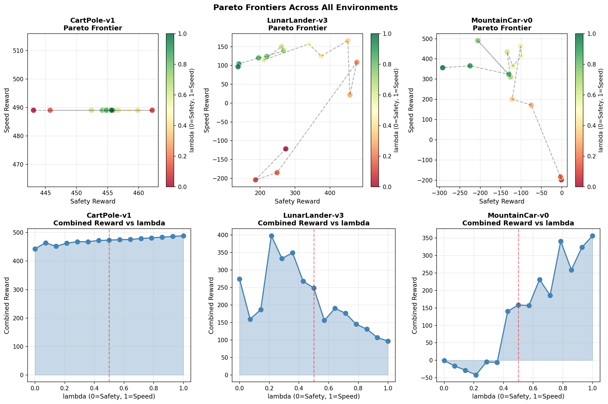
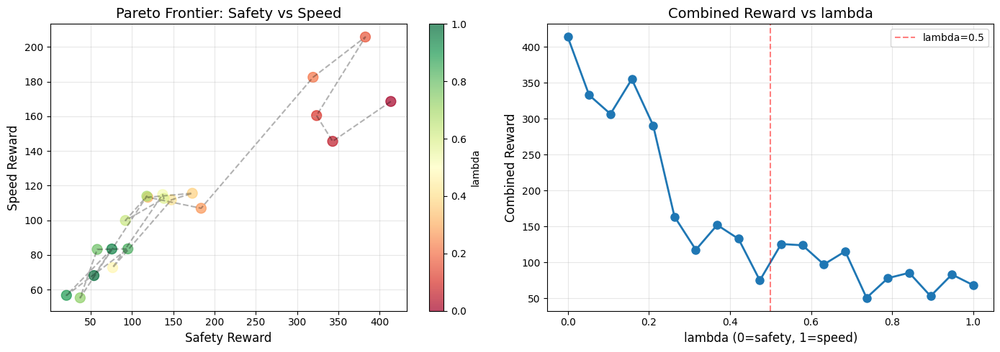
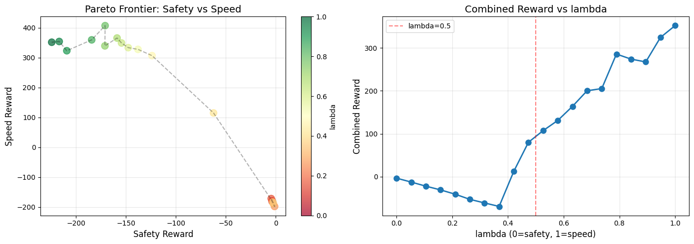
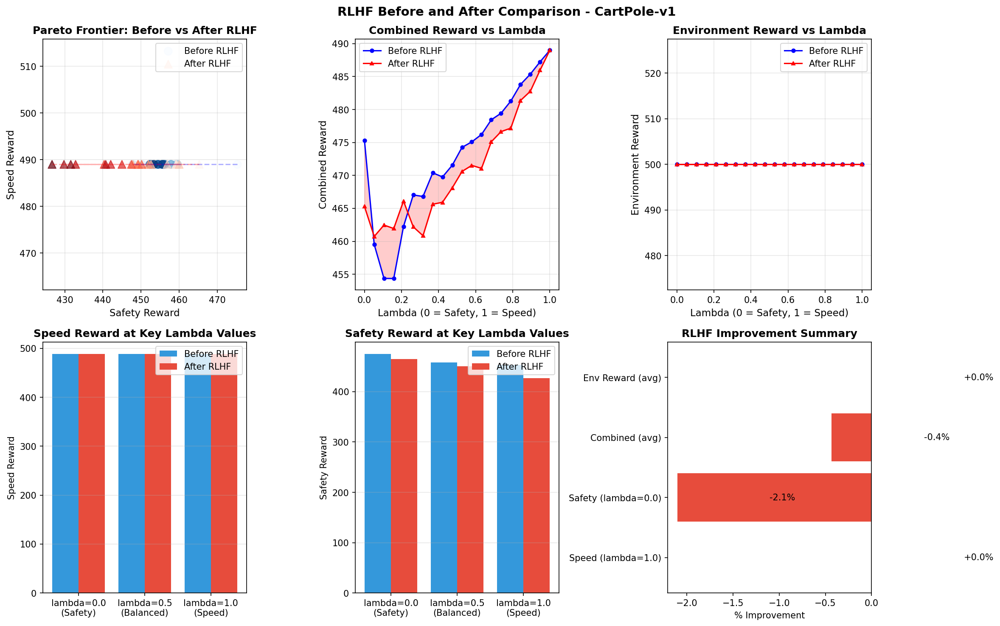
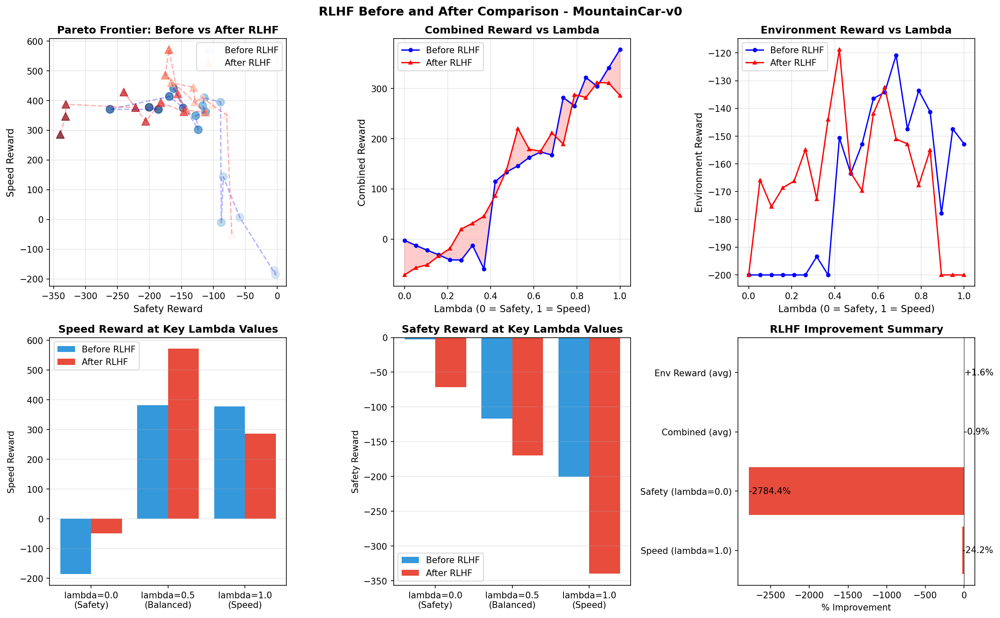
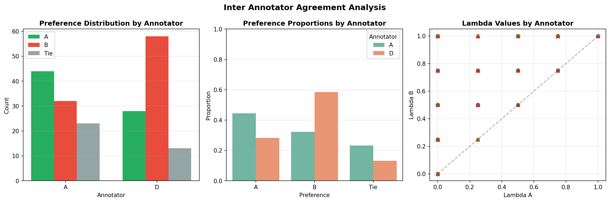

# LAMPO: Language and Preference Conditioned Reinforcement Learning



## Overview

LAMPO (Language and Preference Conditioned RL) is an advanced reinforcement learning framework that trains agents to adapt their behavior based on both numerical preference parameters (lambda) and natural language prompts. This implementation uses Proximal Policy Optimization (PPO) with custom reward decomposition to enable multi-objective learning and dynamic preference adaptation.

## Features

- **Multi-Objective Reward Decomposition**: Decomposes environment rewards into speed and safety components with genuine trade-offs
- **Language Conditioning**: Uses text embeddings to condition agent behavior on natural language prompts
- **Lambda Parameterization**: Enables smooth interpolation between different preference objectives (0 = safety-focused, 1 = speed-focused)
- **Interactive Visualization**: Real-time sliders to adjust preferences and visualize agent behavior
- **Pareto Frontier Analysis**: Visualizes trade-offs between competing objectives
- **RLHF Integration**: Includes Reinforcement Learning from Human Feedback pipeline with preference learning
- **Multi-Environment Support**: Tested on CartPole, LunarLander, and MountainCar

## Architecture

### Core Components

1. **LAMPO Policy Network**: Conditioned on state, lambda value, and text embeddings
2. **LAMPO Value Network**: Estimates state values given current preferences
3. **Reward Model**: Learns from human preferences to shape agent behavior
4. **PPO Training Loop**: Stable policy optimization with GAE and clipping

### Reward Decomposition

Each environment implements custom reward shaping:

- **CartPole**: Balance between staying alive (speed) vs. maintaining upright position (safety)
- **LunarLander**: Trade-off between landing quickly vs. landing gently
- **MountainCar**: Fast goal reaching vs. controlled, smooth movements

## Supported Environments

| Environment | Action Space | State Space | Max Steps |
|-------------|--------------|-------------|-----------|
| CartPole-v1 | 2 (discrete) | 4D continuous | 500 |
| LunarLander-v3 | 4 (discrete) | 8D continuous | 1000 |
| MountainCar-v0 | 3 (discrete) | 2D continuous | 200 |

## Language Prompts

LAMPO supports various natural language prompts that map to different behavior patterns:

### Pure Objectives
- `"be cautious"` - Maximum safety priority
- `"go fast"` - Maximum speed priority  
- `"balanced"` - Equal weight to both objectives

### Mixed Preferences
- `"slightly cautious"` - Prefer safety with some speed
- `"steady progress"` - Balanced with slight caution
- `"risky but smooth"` - Aggressive but controlled
- `"fast but under control"` - Speed-focused with safety awareness
- `"safe but steady"` - High safety with consistent progress
- `"explore and balance"` - Exploratory balanced behavior

## Installation

### Requirements

```bash
# Core dependencies
pip install torch numpy pandas matplotlib seaborn
pip install gymnasium[box2d] minigrid
pip install ipywidgets pyvirtualdisplay pyglet pyopengl
pip install scikit-learn scipy

# For video rendering
apt-get install -y xvfb x11-utils ffmpeg
```

### Platform-Specific Notes

- **Google Colab**: All dependencies pre-configured, includes GPU support
- **Linux**: Requires X virtual display for rendering
- **Windows/Mac**: May need additional OpenGL setup for rendering

## Usage

### Basic Training

```python
# Initialize agent
agent = LAMPOAgent(
    state_dim=state_dimension,
    action_dim=action_dimension,
    text_dim=3,
    lr=3e-4
)

# Train with LAMPO
results = train_lampo(
    env_id="CartPole-v1",
    agent=agent,
    max_episodes=3000,
    batch_size=2048,
    target_reward=200.0
)
```

### Interactive Demo

```python
# Launch interactive widget with sliders
create_interactive_demo(
    agent=trained_agent,
    env_id="LunarLander-v3",
    max_steps=1000
)
```

### Preference Learning (RLHF)

```python
# Collect trajectory preferences
all_meta = build_trajectory_pool_for_all_envs()

# Build preference dataset
build_pairwise_preference_csv(
    all_meta,
    csv_path="human_preferences.csv",
    total_pairs_target=198
)

# Train reward model from preferences
reward_model = train_reward_model(
    csv_path="human_preferences.csv",
    n_epochs=50,
    batch_size=16
)

# Fine-tune agent with learned reward
rlhf_trainer = RLHFTrainer(agent, reward_model, env_id)
rlhf_trainer.fine_tune(n_episodes=300)
```

### Evaluation & Visualization

```python
# Evaluate across different lambda values
for lam in [0.0, 0.5, 1.0]:
    reward = evaluate_lampo(
        agent, 
        env_id, 
        lam_val=lam,
        n_rollouts=10
    )
    print(f"Lambda {lam}: {reward:.2f}")

# Visualize Pareto frontier
visualize_pareto_frontier(
    agent, 
    env_id, 
    n_samples=20
)

# Record video of trained policy
record_trained_video(
    env_id, 
    agent,
    lam_val=0.5,
    prompt="balanced"
)
```

## Key Hyperparameters

| Parameter | CartPole | LunarLander | MountainCar |
|-----------|----------|-------------|-------------|
| Learning Rate | 3e-4 | 3e-4 | 5e-4 |
| Gamma | 0.99 | 0.99 | 0.99 |
| GAE Lambda | 0.95 | 0.95 | 0.95 |
| PPO Clip | 0.2 | 0.2 | 0.2 |
| Entropy Coef | 0.01 | 0.01 | 0.05 |
| Batch Size | 2048 | 2048 | 2048 |
| Max Episodes | 3000 | 4000 | 4000 |

## Results

### Performance Metrics

LAMPO agents successfully learn to:
- **Adapt in real-time** to changing preference parameters
- **Respect language instructions** for different behavioral modes
- **Achieve Pareto-optimal** trade-offs between competing objectives
- **Generalize** across different lambda values without retraining

### Pareto Frontiers

The trained agents exhibit clear Pareto frontiers showing the fundamental trade-off between speed and safety objectives. This validates the multi-objective reward decomposition approach.

#### CartPole


#### LunarLander


#### MountainCar


### RLHF Comparison

Performance improvements after RLHF fine-tuning across all environments:





### Preference Analysis


### Reward Model Evaluation


### Inter-Annotator Agreement



## Project Structure

```
.
├── LAMPO.ipynb                                    # Main notebook with complete implementation
├── README.md                                      # This file
├── pareto_frontiers_all_envs.png                 # Combined Pareto frontiers visualization
├── main_pareto_cart.png                          # CartPole Pareto frontier
├── main_pareto_ll.png                            # LunarLander Pareto frontier
├── main_pareto_mc.png                            # MountainCar Pareto frontier
├── rlhf_comparison_CartPole_v1.png               # RLHF performance comparison
├── rlhf_comparison_LunarLander_v3.png            # RLHF performance comparison
├── rlhf_comparison_MountainCar_v0.png            # RLHF performance comparison
├── preference_analysis.png                        # Preference distribution analysis
├── per_environment_analysis.png                  # Per-environment metrics
├── safety_speed_analysis.png                     # Safety vs speed trade-offs
├── reward_model_evaluation.png                   # Reward model accuracy
└── inter_annotator_agreement.png                 # Annotation consistency metrics
```

## Implementation Details

### Neural Network Architecture

- **Policy Network**: `state + lambda + text_emb → hidden(128) → hidden(128) → action_logits`
- **Value Network**: `state + lambda + text_emb → hidden(128) → hidden(128) → value`
- **Reward Model**: `state_a, state_b → hidden(256) → hidden(128) → preference_logit`

### Training Algorithm

1. **Rollout Collection**: Gather trajectories with random lambda and prompt sampling
2. **Reward Computation**: Decompose environment rewards into r_speed and r_safety
3. **GAE Calculation**: Compute advantages using Generalized Advantage Estimation
4. **PPO Update**: Multiple epochs of minibatch updates with clipping
5. **Evaluation**: Periodic testing across lambda spectrum

### RLHF Pipeline

1. **Trajectory Generation**: Create diverse rollouts with various preferences
2. **Preference Annotation**: Collect pairwise human preferences (or simulated)
3. **Reward Model Training**: Train neural network to predict preferences
4. **Policy Fine-tuning**: Use learned reward to further optimize policy

## Advanced Features

### Adaptation Testing

Test mid-episode lambda switching to validate online adaptation:

```python
test_adaptation(
    agent, 
    env_id, 
    n_episodes=5
)
```

### Multi-Environment Analysis

Run comprehensive analysis across all environments:

```python
reward_model = run_complete_project_analysis(
    csv_path="preferences.csv",
    agents_dict=trained_agents,
    env_ids=environment_list
)
```

### Inter-Annotator Agreement

Analyze consistency of preference labels:

```python
compute_inter_annotator_agreement(
    csv_path="preferences.csv"
)
```

## Technical Notes

### Compatibility

- **Gymnasium API**: Full support for both legacy gym and new gymnasium APIs
- **Step Format Handling**: Automatic detection and processing of 4-tuple and 5-tuple returns
- **Device Flexibility**: Automatic CUDA/CPU selection based on availability

### Reward Scaling

The reward decomposition creates genuine conflicts:
- Speed rewards encourage aggressive, fast-paced behavior
- Safety rewards penalize risky actions and reward stable states
- Lambda interpolates between these extremes: `r = (1-λ)*r_safety + λ*r_speed`

### Text Embeddings

Simple 3D embeddings represent different behavioral modes. In production, these could be replaced with:
- Pretrained sentence transformers (BERT, RoBERTa)
- Task-specific language encoders
- Learned embedding spaces

## Troubleshooting

### Common Issues

**Problem**: Agent not learning
- **Solution**: Check reward scaling, increase training episodes, adjust learning rate

**Problem**: Rendering fails
- **Solution**: Ensure virtual display is running, check ffmpeg installation

**Problem**: CUDA out of memory
- **Solution**: Reduce batch size, use CPU device, or use gradient accumulation

**Problem**: Lambda changes don't affect behavior
- **Solution**: Verify reward decomposition has genuine conflicts, increase lambda conditioning weight

## Future Enhancements

- [ ] Support for continuous action spaces (e.g., MuJoCo environments)
- [ ] Advanced text encoders (CLIP, BERT)
- [ ] Multi-modal preference learning (language + demonstrations)
- [ ] Meta-learning for faster preference adaptation
- [ ] Hierarchical policies with temporal abstraction
- [ ] Real human preference collection interface

## Citation

If you use this code in your research, please cite:

```bibtex
@misc{lampo2025,
  title={LAMPO: Language and Preference Conditioned Reinforcement Learning},
  author={FastReload},
  year={2025},
  howpublished={\url{https://github.com/FastReload/LAMPO-Language-and-Preference-Conditioned-Reinforcement-Learning-Agent}}
}
```

## License

This project is released under the MIT License. See LICENSE file for details.

## Acknowledgments

- OpenAI Gymnasium for providing excellent RL environments
- PyTorch team for the deep learning framework
- The RLHF and preference learning research community

## Repository

GitHub: [LAMPO-Language-and-Preference-Conditioned-Reinforcement-Learning-Agent](https://github.com/FastReload/LAMPO-Language-and-Preference-Conditioned-Reinforcement-Learning-Agent)

## Contact

For questions, issues, or contributions, please open an issue on the [GitHub repository](https://github.com/FastReload/LAMPO-Language-and-Preference-Conditioned-Reinforcement-Learning-Agent/issues).

---

**Note**: This implementation is designed for research and educational purposes. For production deployments, additional safety considerations and extensive testing are recommended.
